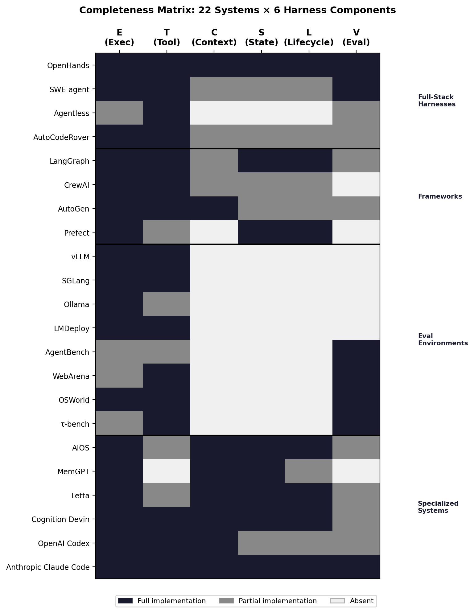

# Agent Harness for Large Language Model Agents: A Survey

<p align="center">
  <a href="https://github.com/Gloriaameng/LLM-Agent-Harness-Survey/stargazers"></a>
  <a href="LICENSE"></a>
  
  
</p>

<p align="center">
  
</p>

---

> **The agent execution harness — not the model — is the primary determinant of agent reliability at scale.**  
> This survey formalizes the harness as a first-class architectural object **H = (E, T, C, S, L, V)**, surveys 140+ papers across 22 systems, and maps 9 open technical challenges.  
> 📄 **[Read the Paper](#)** (coming soon)  
> ✉️ Corrections & suggestions: gloriamenng@gmail.com; chenliyi@xiaohongshu.com

If you find this survey useful, please cite:

```bibtex
@misc{meng2026agentharness,
  title   = {Agent Harness for Large Language Model Agents: A Survey},
  author  = {Meng, Qianyu and Wang, Yanan and Chen, Liyi and Wang, Qimeng and
             Lu, Chengqiang and Wu, Wei and Gao, Yan and Wu, Yi and Hu, Yao},
  year    = {2026},
  url     = {https://github.com/Gloriaameng/LLM-Agent-Harness-Survey},
  note    = {Work in progress}
}
```

---

## 🆕 News & Updates

- **[2026-04]** Initial release

---

## Table of Contents

- [Overview](#overview)
- [Historical Timeline](#historical-timeline)
- [Harness Completeness Matrix](#harness-completeness-matrix)
- [Paper List](#paper-list)
  - [§3 Historical Lineages](#3-historical-lineages)
  - [§4 Harness Taxonomy](#4-harness-taxonomy)
  - [§5 Technical Challenges](#5-technical-challenges)
    - [5.1 Security & Sandboxing](#51-security--sandboxing)
    - [5.2 Evaluation & Benchmarking](#52-evaluation--benchmarking)
    - [5.3 Protocol Standardization](#53-protocol-standardization)
    - [5.4 Runtime Context Management](#54-runtime-context-management)
    - [5.5 Tool Use & Registry](#55-tool-use--registry)
    - [5.6 Memory Architecture](#56-memory-architecture)
    - [5.7 Planning & Reasoning](#57-planning--reasoning)
    - [5.8 Multi-Agent Coordination](#58-multi-agent-coordination)
    - [5.9 Compute Economics](#59-compute-economics)
  - [§6 Emerging Topics](#6-emerging-topics)
  - [§7 Future Directions](#7-future-directions)
- [Citation](#citation)
- [Update Log](#update-log)

---

## Overview

LLM agents are increasingly deployed in agentic settings where they autonomously plan, use tools, and act in multi-step environments. The dominant narrative attributes agent performance to the underlying model. **This survey challenges that assumption.**

We introduce a formal definition of the **agent execution harness** as a six-component tuple:

| Component | Symbol | Role |
|-----------|--------|------|
| Execution Loop | **E** | Observe-think-act cycle, termination conditions, error recovery |
| Tool Registry | **T** | Typed tool catalog, routing, monitoring, schema validation |
| Context Manager | **C** | What enters the context window, compaction, retrieval |
| State Store | **S** | Persistence across turns/sessions, crash recovery |
| Lifecycle Hooks | **L** | Auth, logging, policy enforcement, instrumentation |
| Evaluation Interface | **V** | Action trajectories, intermediate states, success signals |

**Key empirical evidence that harnesses matter:**
- 🔥 Pi Research: Grok Code Fast 1 jumped from **6.7% → 68.3%** on SWE-bench by changing *only* the harness edit-tool format — model unchanged
- 💀 OpenAI Codex: **1M lines of code, 0 hand-written** over 5 months — failure attributed not to model capability but to "underspecified environments"
- ⚡ Stripe Minions: **1,300 PRs/week, 0 human-written code** — harness-first engineering
- 📉 METR: benchmark-passing PRs have a **24.2pp lower** human merge rate, gap widening at 9.6pp/year — evaluation harness validity crisis
- 💬 *"The harness is the chassis; the model is the engine."* — practitioner consensus, 2026

<p align="center">
  
</p>

---

## Historical Timeline

<p align="center">
  
</p>

| Year | Milestone | Significance |
|------|-----------|--------------|
| 1997–2005 | JUnit, TestNG, xUnit family | Software test harness paradigm; standardized observe-assert lifecycle |
| 2016 | OpenAI Gym (Brockman et al.) | RL environment harness; step/reset API becomes canonical interface |
| 2022 Nov | ChatGPT public release; LangChain emerges | LLM-native agent frameworks begin; tool-use as first-class citizen |
| 2023 | ReAct, Toolformer, MemGPT, Reflexion, Voyager, AutoGPT | Core agent patterns: reasoning-acting, memory, reflection, skill accumulation |
| 2023 | CAMEL, ChatDev, Generative Agents | Multi-agent coordination; social simulation harnesses |
| 2023 | AgentBench, SWE-bench | Agent evaluation infrastructure emerges |
| 2024 | MetaGPT, WebArena, ToolLLM, SWE-agent, OSWorld | Full-stack harnesses; real-world environment benchmarks |
| 2024 | CodeAct, LATS, Tree of Thoughts | Structured action spaces; search-augmented planning |
| 2024 Nov | Anthropic releases MCP protocol | First major tool↔harness standardization (2–15ms latency) |
| 2025 | HAL, AIOS, LangGraph | Benchmark unification (21,730 rollouts); OS-level scheduling (2.1× speedup) |
| 2025 | Google releases A2A protocol | Agent↔agent standardization (50–200ms) |
| 2025 | MemoryOS, SkillsBench†, AgentBound† | Memory OS abstraction; skills-as-context (+16.2pp); safety certification |
| 2026 Jan–Mar | AgencyBench†, SandboxEscapeBench†, PRISM†, AEGIS†, SkillFortify†, Schema First† | Compute economics; 15–35% escape rates; runtime security; schema discipline |

*† preprint*

---

## Harness Completeness Matrix

**Legend:** ✓ full support · ≈ partial · ✗ absent

<p align="center">
  
</p>

<table align="center">
  <thead>
    <tr>
      <th>Category</th>
      <th>System</th>
      <th title="Execution Loop">E</th>
      <th title="Tool Registry">T</th>
      <th title="Context Manager">C</th>
      <th title="State Store">S</th>
      <th title="Lifecycle Hooks">L</th>
      <th title="Evaluation Interface">V</th>
    </tr>
  </thead>
  <tbody>
    <tr>
      <td rowspan="5"><strong>Full-Stack<br>Harnesses</strong></td>
      <td>OpenClaw / PRISM</td>
      <td>✓</td><td>✓</td><td>✓</td><td>✓</td><td>✓</td><td>✓</td>
    </tr>
    <tr>
      <td>AIOS</td>
      <td>✓</td><td>✓</td><td>✓</td><td>✓</td><td>✓</td><td>≈</td>
    </tr>
    <tr>
      <td>OpenHands</td>
      <td>✓</td><td>✓</td><td>✓</td><td>✓</td><td>✓</td><td>≈</td>
    </tr>
    <tr>
      <td>SWE-agent</td>
      <td>✓</td><td>✓</td><td>✓</td><td>≈</td><td>≈</td><td>✓</td>
    </tr>
    <tr>
      <td>HAL</td>
      <td>✓</td><td>✓</td><td>≈</td><td>≈</td><td>≈</td><td>✓</td>
    </tr>
    <tr>
      <td rowspan="6"><strong>Multi-Agent<br>Harnesses</strong></td>
      <td>MetaGPT</td>
      <td>✓</td><td>✓</td><td>≈</td><td>≈</td><td>≈</td><td>≈</td>
    </tr>
    <tr>
      <td>AutoGen</td>
      <td>✓</td><td>✓</td><td>≈</td><td>≈</td><td>≈</td><td>≈</td>
    </tr>
    <tr>
      <td>DeerFlow</td>
      <td>✓</td><td>✓</td><td>≈</td><td>≈</td><td>≈</td><td>≈</td>
    </tr>
    <tr>
      <td>DeepAgents</td>
      <td>✓</td><td>✓</td><td>≈</td><td>≈</td><td>≈</td><td>≈</td>
    </tr>
    <tr>
      <td>ChatDev</td>
      <td>✓</td><td>≈</td><td>≈</td><td>≈</td><td>≈</td><td>≈</td>
    </tr>
    <tr>
      <td>CAMEL</td>
      <td>✓</td><td>≈</td><td>≈</td><td>≈</td><td>✗</td><td>≈</td>
    </tr>
    <tr>
      <td rowspan="8"><strong>Frameworks &amp;<br>Modules</strong></td>
      <td>LangChain</td>
      <td>✓</td><td>✓</td><td>✓</td><td>≈</td><td>≈</td><td>✗</td>
    </tr>
    <tr>
      <td>LangGraph</td>
      <td>✓</td><td>≈</td><td>≈</td><td>≈</td><td>✗</td><td>✗</td>
    </tr>
    <tr>
      <td>LlamaIndex</td>
      <td>≈</td><td>✓</td><td>✓</td><td>≈</td><td>✗</td><td>✗</td>
    </tr>
    <tr>
      <td>MemGPT</td>
      <td>✗</td><td>✗</td><td>✓</td><td>✓</td><td>✗</td><td>✗</td>
    </tr>
    <tr>
      <td>Voyager</td>
      <td>✓</td><td>✓</td><td>≈</td><td>✓</td><td>✗</td><td>≈</td>
    </tr>
    <tr>
      <td>Reflexion</td>
      <td>≈</td><td>✗</td><td>≈</td><td>✓</td><td>✗</td><td>≈</td>
    </tr>
    <tr>
      <td>Generative Agents</td>
      <td>✓</td><td>✗</td><td>≈</td><td>✓</td><td>✗</td><td>≈</td>
    </tr>
    <tr>
      <td>Concordia</td>
      <td>✓</td><td>✗</td><td>≈</td><td>✓</td><td>✗</td><td>≈</td>
    </tr>
    <tr>
      <td rowspan="3"><strong>Evaluation<br>Infrastructure</strong></td>
      <td>AgentBench</td>
      <td>✓</td><td>≈</td><td>≈</td><td>≈</td><td>✗</td><td>✓</td>
    </tr>
    <tr>
      <td>OSWorld</td>
      <td>✓</td><td>≈</td><td>≈</td><td>≈</td><td>✗</td><td>✓</td>
    </tr>
    <tr>
      <td>BrowserGym</td>
      <td>✓</td><td>✓</td><td>≈</td><td>≈</td><td>✗</td><td>✓</td>
    </tr>
  </tbody>
</table>

---

## Paper List

### §3 Historical Lineages

#### 3.1 Software Test Harnesses (1990s–2000s)

1. <u>JUnit</u>: **"JUnit: A Cook's Tour"**. *Beck & Gamma.* Java Report, 4(5), May 1999. [[Article](http://junit.sourceforge.net/doc/cookstour/cookstour.htm)]

#### 3.2 RL Environment Harnesses (2016–2022)

1. <u>OpenAI Gym</u>: **"OpenAI Gym"**. *Brockman et al.* arXiv 2016. [[Paper](https://arxiv.org/abs/1606.01540)] [[Code](https://github.com/openai/gym)]
2. <u>Gymnasium</u>: **"Gymnasium: A Standard Interface for Reinforcement Learning Environments"**. *Towers et al.* NeurIPS 2025. [[Paper](https://arxiv.org/abs/2407.17032)] [[Code](https://github.com/Farama-Foundation/Gymnasium)]

#### 3.3 Early LLM Agent Frameworks (2023–2024)

1. <u>ReAct</u>: **"ReAct: Synergizing Reasoning and Acting in Language Models"**. *Yao et al.* ICLR 2023. [[Paper](https://arxiv.org/abs/2210.03629)] [[Code](https://github.com/ysymyth/ReAct)]
2. <u>Toolformer</u>: **"Toolformer: Language Models Can Teach Themselves to Use Tools"**. *Schick et al.* NeurIPS 2023. [[Paper](https://arxiv.org/abs/2302.04761)]
3. <u>AutoGPT</u>: **"Auto-GPT: An Autonomous GPT-4 Experiment"**. *Gravitas et al.* GitHub 2023. [[Code](https://github.com/Significant-Gravitas/AutoGPT)]
4. <u>LangChain</u>: **"LangChain: Building Applications with LLMs through Composability"**. *Chase et al.* GitHub 2022. [[Code](https://github.com/langchain-ai/langchain)]

---

### §4 Harness Taxonomy

#### 4.1 Full-Stack Harnesses

1. <u>PRISM/OpenClaw</u>: **"OpenClaw PRISM: A Zero-Fork, Defense-in-Depth Runtime Security Layer for Tool-Augmented LLM Agents"**. *Li.* arXiv 2026. [[Paper](https://arxiv.org/abs/2603.11853)]
2. <u>AIOS</u>: **"AIOS: LLM Agent Operating System"**. *Mei et al.* COLM 2025. [[Paper](https://arxiv.org/abs/2403.16971)] [[Code](https://github.com/agiresearch/AIOS)]
3. <u>OpenHands</u>: **"OpenHands: An Open Platform for AI Software Developers as Generalist Agents"**. *Wang et al.* ICLR 2025. [[Paper](https://arxiv.org/abs/2407.16741)] [[Code](https://github.com/All-Hands-AI/OpenHands)]
4. <u>SWE-agent</u>: **"SWE-agent: Agent-Computer Interfaces Enable Automated Software Engineering"**. *Yang et al.* NeurIPS 2024. [[Paper](https://arxiv.org/abs/2405.15793)] [[Code](https://github.com/SWE-agent/SWE-agent)]
5. <u>HAL</u>: **"Holistic Agent Leaderboard: The Missing Infrastructure for AI Agent Evaluation"**. *Kapoor et al.* arXiv 2025. [[Paper](https://arxiv.org/abs/2510.11977)]

#### 4.2 Multi-Agent Harnesses

1. <u>MetaGPT</u>: **"MetaGPT: Meta Programming for a Multi-Agent Collaborative Framework"**. *Hong et al.* ICLR 2024. [[Paper](https://arxiv.org/abs/2308.00352)] [[Code](https://github.com/geekan/MetaGPT)]
2. <u>AutoGen</u>: **"AutoGen: Enabling Next-Gen LLM Applications via Multi-Agent Conversation"**. *Wu et al.* arXiv 2023. [[Paper](https://arxiv.org/abs/2308.08155)] [[Code](https://github.com/microsoft/autogen)]
3. <u>ChatDev</u>: **"ChatDev: Communicative Agents for Software Development"**. *Qian et al.* ACL 2024. [[Paper](https://arxiv.org/abs/2307.07924)] [[Code](https://github.com/OpenBMB/ChatDev)]
4. <u>CAMEL</u>: **"CAMEL: Communicative Agents for 'Mind' Exploration of Large Language Model Society"**. *Li et al.* NeurIPS 2023. [[Paper](https://arxiv.org/abs/2303.17760)] [[Code](https://github.com/camel-ai/camel)]

#### 4.3 Frameworks & Modules

1. <u>LangGraph</u>: **"LangGraph: Build Resilient Language Agents as Graphs"**. *LangChain team.* GitHub 2024. [[Code](https://github.com/langchain-ai/langgraph)]
2. <u>MemGPT</u>: **"MemGPT: Towards LLMs as Operating Systems"**. *Packer et al.* NeurIPS 2023. [[Paper](https://arxiv.org/abs/2310.08560)] [[Code](https://github.com/cpacker/MemGPT)]
3. <u>Voyager</u>: **"Voyager: An Open-Ended Embodied Agent with Large Language Models"**. *Wang et al.* arXiv 2023. [[Paper](https://arxiv.org/abs/2305.16291)] [[Code](https://github.com/MineDojo/Voyager)]
4. <u>Reflexion</u>: **"Reflexion: Language Agents with Verbal Reinforcement Learning"**. *Shinn et al.* NeurIPS 2023. [[Paper](https://arxiv.org/abs/2303.11366)] [[Code](https://github.com/noahshinn/reflexion)]
5. <u>Generative Agents</u>: **"Generative Agents: Interactive Simulacra of Human Behavior"**. *Park et al.* UIST 2023. [[Paper](https://arxiv.org/abs/2304.03442)] [[Code](https://github.com/joonspk-research/generative_agents)]

#### 4.4 Evaluation Infrastructure

1. <u>AgentBench</u>: **"AgentBench: Evaluating LLMs as Agents"**. *Liu et al.* ICLR 2024. [[Paper](https://arxiv.org/abs/2308.03688)] [[Code](https://github.com/THUDM/AgentBench)]
2. <u>SWE-bench</u>: **"SWE-bench: Can Language Models Resolve Real-World GitHub Issues?"**. *Jimenez et al.* ICLR 2024. [[Paper](https://arxiv.org/abs/2310.06770)] [[Code](https://github.com/swebench/SWE-bench)]
3. <u>OSWorld</u>: **"OSWorld: Benchmarking Multimodal Agents for Open-Ended Tasks in Real Computer Environments"**. *Xie et al.* NeurIPS 2024. [[Paper](https://arxiv.org/abs/2404.07972)] [[Code](https://github.com/xlang-ai/OSWorld)]
4. <u>WebArena</u>: **"WebArena: A Realistic Web Environment for Building Autonomous Agents"**. *Zhou et al.* ICLR 2024. [[Paper](https://arxiv.org/abs/2307.13854)] [[Code](https://github.com/web-arena-x/webarena)]

---

### §5 Technical Challenges

#### 5.1 Security & Sandboxing

> **Key numbers:** SandboxEscapeBench — frontier LLMs achieve **15–35% container escape rates**; PRISM — 10-hook zero-fork runtime reduces escape to near-zero with <5ms overhead.

1. <u>SandboxEscapeBench</u>†: **"Quantifying Frontier LLM Capabilities for Container Sandbox Escape"**. *Marchand et al.* arXiv 2026. [[Paper](https://arxiv.org/abs/2603.02277)]
2. <u>PRISM</u>†: **"OpenClaw PRISM: A Zero-Fork, Defense-in-Depth Runtime Security Layer for Tool-Augmented LLM Agents"**. *Li.* arXiv 2026. [[Paper](https://arxiv.org/abs/2603.11853)]
3. <u>InjecAgent</u>: **"InjecAgent: Benchmarking Indirect Prompt Injections in Tool-Integrated Large Language Model Agents"**. *Zhan et al.* arXiv 2024. [[Paper](https://arxiv.org/abs/2403.02691)]
4. <u>ToolHijacker</u>†: **"Prompt Injection Attack to Tool Selection in LLM Agents"**. *Shi et al.* NDSS 2026. [[Paper](https://arxiv.org/abs/2504.19793)]
5. <u>Securing MCP</u>†: **"Securing the Model Context Protocol (MCP): Risks, Controls, and Governance"**. *Errico et al.* arXiv 2025. [[Paper](https://arxiv.org/abs/2511.20920)]
6. <u>SHIELDA</u>†: **"SHIELDA: Structured Handling of Exceptions in LLM-Driven Agentic Workflows"**. *Zhou et al.* arXiv 2025. [[Paper](https://arxiv.org/abs/2508.07935)]
7. <u>PALADIN</u>†: **"PALADIN: Self-Correcting Language Model Agents to Cure Tool-Failure Cases"**. *Vuddanti et al.* ICLR 2026. [[Paper](https://arxiv.org/abs/2509.25238)]
8. <u>AgentBound</u>†: **"Securing AI Agent Execution"**. *Bühler et al.* arXiv 2025. [[Paper](https://arxiv.org/abs/2510.21236)]

#### 5.2 Evaluation & Benchmarking

> **Key numbers:** HAL unified **21,730 rollouts**, compressing weeks of evaluation to hours; OSWorld reports **28% false negative rate** in automated evaluation; METR finds benchmark-passing PRs have **24.2pp lower** human merge rate, widening at 9.6pp/year.

1. <u>HAL</u>: **"Holistic Agent Leaderboard: The Missing Infrastructure for AI Agent Evaluation"**. *Kapoor et al.* arXiv 2025. [[Paper](https://arxiv.org/abs/2510.11977)]
2. <u>AgencyBench</u>†: **"AgencyBench: Benchmarking the Frontiers of Autonomous Agents in 1M-Token Real-World Contexts"**. *Li et al.* arXiv 2026. [[Paper](https://arxiv.org/abs/2601.11044)]
3. <u>OSWorld</u>: **"OSWorld: Benchmarking Multimodal Agents for Open-Ended Tasks in Real Computer Environments"**. *Xie et al.* NeurIPS 2024. [[Paper](https://arxiv.org/abs/2404.07972)]
4. <u>SWE-bench</u>: **"SWE-bench: Can Language Models Resolve Real-World GitHub Issues?"**. *Jimenez et al.* ICLR 2024. [[Paper](https://arxiv.org/abs/2310.06770)]
5. <u>AEGIS</u>†: **"AEGIS: No Tool Call Left Unchecked -- A Pre-Execution Firewall and Audit Layer for AI Agents"**. *Yuan et al.* arXiv 2026. [[Paper](https://arxiv.org/abs/2603.12621)]
6. <u>Hell or High Water</u>†: **"Hell or High Water: Evaluating Agentic Recovery from External Failures"**. *Wang et al.* COLM 2025. [[Paper](https://arxiv.org/abs/2508.11027)]

#### 5.3 Protocol Standardization

> **Key numbers:** MCP (tool↔harness): 2–15ms latency; A2A (agent↔agent): 50–200ms; ACP (intent-level, IBM) — three protocols serve complementary roles.

1. <u>MCP</u>: **"Model Context Protocol"**. *Anthropic.* Technical Report 2024. [[Spec](https://modelcontextprotocol.io)]
2. <u>A2A</u>: **"Agent-to-Agent Protocol"**. *Google.* Technical Report 2025. [[Spec](https://google.github.io/A2A/)]
3. <u>Protocol Comparison</u>†: **"A Survey of Agent Interoperability Protocols: Model Context Protocol (MCP), Agent Communication Protocol (ACP), Agent-to-Agent Protocol (A2A), and Agent Network Protocol (ANP)"**. *Ehtesham et al.* arXiv 2025. [[Paper](https://arxiv.org/abs/2505.02279)]
4. <u>Gorilla</u>: **"Gorilla: Large Language Model Connected with Massive APIs"**. *Patil et al.* NeurIPS 2023. [[Paper](https://arxiv.org/abs/2305.15334)] [[Code](https://github.com/ShishirPatil/gorilla)]

#### 5.4 Runtime Context Management

> **Key numbers:** SkillsBench — curated skill injection yields **+16.2pp** improvement; "Lost in the Middle" effect documented; long-context models shift the problem from *retention* to *salience*.

1. <u>SkillsBench</u>†: **"SkillsBench: Benchmarking How Well Agent Skills Work Across Diverse Tasks"**. *Li et al.* arXiv 2026. [[Paper](https://arxiv.org/abs/2602.12670)]
2. <u>ReadAgent</u>: **"A Human-Inspired Reading Agent with Gist Memory of Very Long Contexts"**. *Lee et al.* ICML 2024. [[Paper](https://arxiv.org/abs/2402.09727)]
3. <u>MemoryOS</u>: **"Memory OS of AI Agent"**. *Kang et al.* arXiv 2025. [[Paper](https://arxiv.org/abs/2506.06326)]
4. <u>CoALA</u>: **"Cognitive Architectures for Language Agents"**. *Sumers et al.* TMLR 2024. [[Paper](https://arxiv.org/abs/2309.02427)]
5. <u>SkillFortify</u>†: **"Formal Analysis and Supply Chain Security for Agentic AI Skills"**. *Bhardwaj.* arXiv 2026. [[Paper](https://arxiv.org/abs/2603.00195)]

#### 5.5 Tool Use & Registry

> **Key numbers:** Vercel found removing **80% of tools** helped more than any model upgrade; Schema First reduces tool misuse by **>40%**; CodeAct outperforms on **17/17 Mint benchmarks** with **−20% turns**.

1. <u>CodeAct</u>: **"Executable Code Actions Elicit Better LLM Agents"**. *Wang et al.* ICML 2024. [[Paper](https://arxiv.org/abs/2402.01030)] [[Code](https://github.com/xingyaoww/code-act)]
2. <u>Schema First</u>†: **"Schema First Tool APIs for LLM Agents: A Controlled Study of Tool Misuse, Recovery, and Budgeted Performance"**. *Sigdel & Baral.* arXiv 2026. [[Paper](https://arxiv.org/abs/2603.13404)]
3. <u>ToolLLM</u>: **"ToolLLM: Facilitating Large Language Models to Master 16000+ Real-world APIs"**. *Qin et al.* ICLR 2024. [[Paper](https://arxiv.org/abs/2307.16789)] [[Code](https://github.com/OpenBMB/ToolBench)]
4. <u>ToolSandbox</u>†: **"ToolSandbox: A Stateful, Conversational, Interactive Evaluation Benchmark for LLM Tool Use Capabilities"**. *Lu et al.* arXiv 2024. [[Paper](https://arxiv.org/abs/2408.04682)]
5. <u>AutoTool</u>†: **"AutoTool: Efficient Tool Selection for Large Language Model Agents"**. *Jia & Li.* AAAI 2026. [[Paper](https://arxiv.org/abs/2511.14650)]
6. <u>Gorilla</u>: **"Gorilla: Large Language Model Connected with Massive APIs"**. *Patil et al.* NeurIPS 2023. [[Paper](https://arxiv.org/abs/2305.15334)]

#### 5.6 Memory Architecture

> **Key numbers:** Mem0 achieves **90% token reduction** vs full-context; Zep temporal knowledge: **+18.5% QA accuracy**; Agent Workflow Memory: **+14.9%** on Mind2Web. Six architectural patterns: flat buffer → hierarchical → episodic → semantic → procedural → graph.

1. <u>MemGPT</u>: **"MemGPT: Towards LLMs as Operating Systems"**. *Packer et al.* NeurIPS 2023. [[Paper](https://arxiv.org/abs/2310.08560)]
2. <u>CoALA</u>: **"Cognitive Architectures for Language Agents"**. *Sumers et al.* TMLR 2024. [[Paper](https://arxiv.org/abs/2309.02427)]
3. <u>Agent Workflow Memory (AWM)</u>†: **"Agent Workflow Memory"**. *Wang et al.* arXiv 2024. [[Paper](https://arxiv.org/abs/2409.07429)]
4. <u>Mem0</u>†: **"Mem0: Building Production-Ready AI Agents with Scalable Long-Term Memory"**. *Khant et al.* arXiv 2025. [[Paper](https://arxiv.org/abs/2504.19413)]
5. <u>A-MEM</u>†: **"A-MEM: Agentic Memory for LLM Agents"**. *Xu et al.* NeurIPS 2025. [[Paper](https://arxiv.org/abs/2502.12110)]
6. <u>MemAct</u>†: **"Memory as Action: Autonomous Context Curation for Long-Horizon Agentic Tasks"**. *Zhang et al.* arXiv 2025. [[Paper](https://arxiv.org/abs/2510.12635)]

#### 5.7 Planning & Reasoning

> **Key numbers:** SWE-agent ACI study shows interface design outweighs model capability as the primary performance determinant. LATS integrates MCTS with language model feedback for state-space search.

1. <u>ReAct</u>: **"ReAct: Synergizing Reasoning and Acting in Language Models"**. *Yao et al.* ICLR 2023. [[Paper](https://arxiv.org/abs/2210.03629)]
2. <u>Tree of Thoughts</u>: **"Tree of Thoughts: Deliberate Problem Solving with Large Language Models"**. *Yao et al.* NeurIPS 2023. [[Paper](https://arxiv.org/abs/2305.10601)] [[Code](https://github.com/princeton-nlp/tree-of-thought-llm)]
3. <u>LATS</u>: **"Language Agent Tree Search Unifies Reasoning, Acting, and Planning in Language Models"**. *Zhou et al.* arXiv 2023. [[Paper](https://arxiv.org/abs/2310.04406)] [[Code](https://github.com/lapisrocks/LanguageAgentTreeSearch)]
4. <u>Reflexion</u>: **"Reflexion: Language Agents with Verbal Reinforcement Learning"**. *Shinn et al.* NeurIPS 2023. [[Paper](https://arxiv.org/abs/2303.11366)]
5. <u>AFlow</u>†: **"AFlow: Automating Agentic Workflow Generation"**. *Zhang et al.* arXiv 2024. [[Paper](https://arxiv.org/abs/2410.10762)]
6. <u>Agent Q</u>†: **"Agent Q: Advanced Reasoning and Learning for Autonomous AI Agents"**. *Putta et al.* arXiv 2024. [[Paper](https://arxiv.org/abs/2408.07199)]

#### 5.8 Multi-Agent Coordination

> **Key numbers:** AgencyBench — agents achieve **48.4% success on native SDK harness** vs substantially lower on independent harnesses, demonstrating tight harness-agent coupling. Byzantine fault tolerance remains an open problem for adversarial multi-agent settings.

<p align="center">
  
</p>

1. <u>MetaGPT</u>: **"MetaGPT: Meta Programming for a Multi-Agent Collaborative Framework"**. *Hong et al.* ICLR 2024. [[Paper](https://arxiv.org/abs/2308.00352)]
2. <u>CAMEL</u>: **"CAMEL: Communicative Agents for 'Mind' Exploration"**. *Li et al.* NeurIPS 2023. [[Paper](https://arxiv.org/abs/2303.17760)]
3. <u>SAGA</u>†: **"SAGA: A Security Architecture for Governing AI Agentic Systems"**. *Syros et al.* NDSS 2026. [[Paper](https://arxiv.org/abs/2504.21034)]
4. <u>MAS-FIRE</u>†: **"MAS-FIRE: Fault Injection and Reliability Evaluation for LLM-Based Multi-Agent Systems"**. *Jia et al.* arXiv 2026. [[Paper](https://arxiv.org/abs/2602.19843)]
5. <u>Byzantine fault tolerance</u>†: **"Rethinking the Reliability of Multi-agent System: A Perspective from Byzantine Fault Tolerance"**. *Zheng et al.* arXiv 2025. [[Paper](https://arxiv.org/abs/2511.10400)]
6. <u>Multi-agent baseline study</u>†: **"Rethinking the Value of Multi-Agent Workflow: A Strong Single Agent Baseline"**. *Xu et al.* arXiv 2026. [[Paper](https://arxiv.org/abs/2601.12307)]
7. <u>InjecAgent</u>: **"InjecAgent: Benchmarking Indirect Prompt Injections in Tool-Integrated Large Language Model Agents"**. *Zhan et al.* arXiv 2024. [[Paper](https://arxiv.org/abs/2403.02691)]

#### 5.9 Compute Economics

> **Key numbers:** OpenRouter reports **13T tokens/week** (Feb 2026), doubling every 4 weeks; AgencyBench measures **1M tokens/task** average; 1000× agent compute growth projected by 2027; AIOS achieves **2.1× throughput speedup** via proper agent scheduling.

1. <u>AgencyBench</u>†: **"AgencyBench: Benchmarking the Frontiers of Autonomous Agents in 1M-Token Real-World Contexts"**. *Li et al.* arXiv 2026. [[Paper](https://arxiv.org/abs/2601.11044)]
2. <u>AIOS</u>: **"AIOS: LLM Agent Operating System"**. *Mei et al.* COLM 2025. [[Paper](https://arxiv.org/abs/2403.16971)]
3. <u>Repo2Run</u>†: **"Repo2Run: Automated Building Executable Environment for Code Repository at Scale"**. *Hu et al.* arXiv 2025. [[Paper](https://arxiv.org/abs/2502.13681)]
4. <u>Policy-First</u>†: **"Guardrails as Infrastructure: Policy-First Control for Tool-Orchestrated Workflows"**. *Sigdel & Baral.* arXiv 2026. [[Paper](https://arxiv.org/abs/2603.18059)]

---

### §6 Emerging Topics

1. <u>SkillFortify</u>†: **"Formal Analysis and Supply Chain Security for Agentic AI Skills"**. *Bhardwaj.* arXiv 2026. [[Paper](https://arxiv.org/abs/2603.00195)]
2. <u>AEGIS</u>†: **"AEGIS: No Tool Call Left Unchecked -- A Pre-Execution Firewall and Audit Layer for AI Agents"**. *Yuan et al.* arXiv 2026. [[Paper](https://arxiv.org/abs/2603.12621)]
3. <u>Policy-First</u>†: **"Guardrails as Infrastructure: Policy-First Control for Tool-Orchestrated Workflows"**. *Sigdel & Baral.* arXiv 2026. [[Paper](https://arxiv.org/abs/2603.18059)]
4. <u>MemoryOS</u>: **"Memory OS of AI Agent"**. *Kang et al.* arXiv 2025. [[Paper](https://arxiv.org/abs/2506.06326)]
5. <u>Protocol Comparison</u>†: **"A Survey of Agent Interoperability Protocols: Model Context Protocol (MCP), Agent Communication Protocol (ACP), Agent-to-Agent Protocol (A2A), and Agent Network Protocol (ANP)"**. *Ehtesham et al.* arXiv 2025. [[Paper](https://arxiv.org/abs/2505.02279)]

---

### §7 Future Directions

Eight open research directions identified in the survey (no curated paper list — these are forward-looking):

1. **Formal Harness Specification Language** — DSL for specifying and verifying H=(E,T,C,S,L,V) components
2. **Cross-Harness Benchmark Suite** — portability testing across incompatible harness ecosystems
3. **Security Taxonomy & Threat Model** — extension of OWASP Top 10 to agent harness attack surfaces
4. **Protocol Interoperability (MCP/A2A)** — bridging tool-level and agent-level protocols
5. **Long-Horizon Evaluation Methodology** — metrics that don't degrade under multi-session, multi-day tasks
6. **Harness-Aware Fine-Tuning** — training models that are aware of their execution environment
7. **Memory Interface Standardization** — portable memory APIs across flat, episodic, and graph stores
8. **Harness Transparency Specification** — auditability and explainability for runtime decisions

---

## Citation

See BibTeX at the top of this README.

---

## Update Log

| Version | Date | Changes |
|---------|------|---------|
|  v1 | 2026-04 | Initial preprint |

---

<p align="center">
  <i>† denotes preprint, not yet peer-reviewed.</i><br>
  <i>This survey is under active development; the full manuscript will be released soon.</i><br>
  <i>Maintained by Qianyu Meng & Liyi Chen. PRs welcome for missing papers or updated links.</i>
</p>
