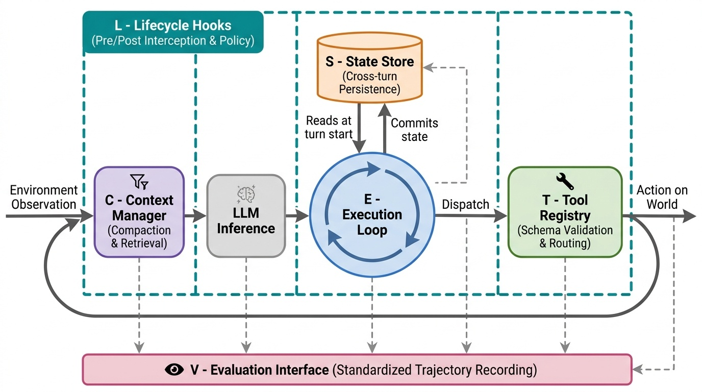
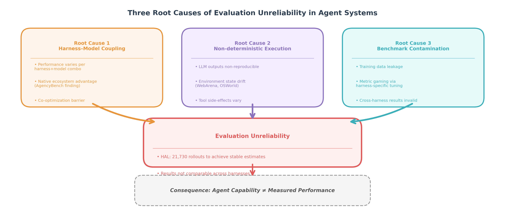
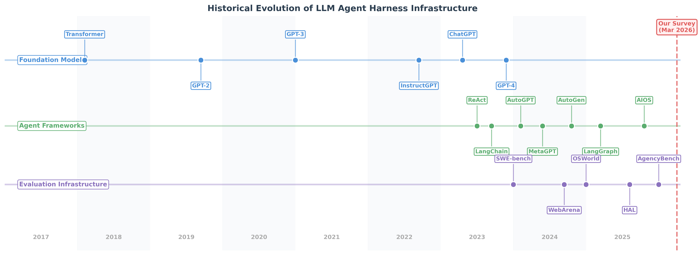
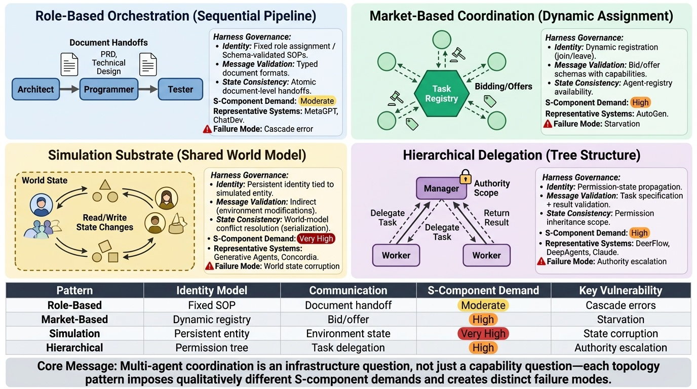

<div align="center">

[English](README.md) | [中文](README_zh.md)

# Agent Harness for Large Language Model Agents: A Survey

[](https://github.com/Gloriaameng/LLM-Agent-Harness-Survey/stargazers)
[](LICENSE)
[]()
[]()
[](https://huggingface.co/datasets/GloriaaaM/LLM-Agent-Harness-Survey)
[](https://www.preprints.org/manuscript/202604.0428/v2)

</div>

<p align="center">
  
</p>

> ⭐ **This repo is actively maintained. If you find it useful, please star the repo to stay updated and help others find it.**

---

> **The agent execution harness — not the model — is the primary determinant of agent reliability at scale.**  
> This survey formalizes the harness as a first-class architectural object **H = (E, T, C, S, L, V)**, surveys 110+ papers, blogs and reports across 23 systems, and maps 9 open technical challenges.  
> 📄 **[Read the Paper](./Agent_Harness_for_LLM_Agents__A_Survey_v3.pdf)** (Latest version, under review)  
> 🌐 **[Preprints Version (v2)](https://www.preprints.org/manuscript/202604.0428/v2)**  
> ✉️ Corrections & suggestions: gloriamenng@gmail.com (Qianyu Meng); wangyanan@mail.dlut.edu.cn (Yanan Wang); chenliyi@xiaohongshu.com (Liyi Chen)

If you find this survey useful, please cite:

```bibtex
@misc{meng2026agentharness,
  title   = {Agent Harness for Large Language Model Agents: A Survey},
  author  = {Meng, Qianyu* and Wang, Yanan* and Chen, Liyi and Wang, Qimeng and
             Lu, Chengqiang and Wu, Wei and Gao, Yan and Wu, Yi and Hu, Yao},
  year    = {2026},
  doi     = {10.20944/preprints202604.0428.v2},
  url     = {https://www.preprints.org/manuscript/202604.0428/v2},
  publisher = {Preprints},
  note    = {* Equal contribution. Under review, latest version available at: https://github.com/Gloriaameng/LLM-Agent-Harness-Survey}
}
```

---

## 🆕 News & Updates

- **[2026-04-03]** Initial release
- **[2026-04-07]** Repo updated
- **[2026-04-09]** Preprint released

---

## Table of Contents

- [Overview](#overview)
- [Historical Timeline](#historical-timeline)
- [Harness Completeness Matrix](#harness-completeness-matrix)
- [Paper List](#paper-list)
  - [Historical Lineages](#historical-lineages)
  - [Harness Taxonomy](#harness-taxonomy)
  - [Technical Challenges](#technical-challenges)
    - [Security & Sandboxing](#security--sandboxing)
    - [Evaluation & Benchmarking](#evaluation--benchmarking)
    - [Protocol Standardization](#protocol-standardization)
    - [Runtime Context Management](#runtime-context-management)
    - [Tool Use & Registry](#tool-use--registry)
    - [Memory Architecture](#memory-architecture)
    - [Planning & Reasoning](#planning--reasoning)
    - [Multi-Agent Coordination](#multi-agent-coordination)
    - [Compute Economics](#compute-economics)
  - [Emerging Topics](#emerging-topics)
  - [Future Directions](#future-directions)
- [Citation](#citation)
- [Update Log](#update-log)

---

## Overview

LLM agents are increasingly deployed in agentic settings where they autonomously plan, use tools, and act in multi-step environments. The dominant narrative attributes agent performance to the underlying model. **This survey challenges that assumption.**

We introduce a formal definition of the **agent execution harness** as a six-component tuple:

| Component | Symbol | Role |
|-----------|--------|------|
| Execution Loop | **E** | Observe-think-act cycle, termination conditions, error recovery |
| Tool Registry | **T** | Typed tool catalog, routing, monitoring, schema validation |
| Context Manager | **C** | What enters the context window, compaction, retrieval |
| State Store | **S** | Persistence across turns/sessions, crash recovery |
| Lifecycle Hooks | **L** | Auth, logging, policy enforcement, instrumentation |
| Evaluation Interface | **V** | Action trajectories, intermediate states, success signals |

**Key empirical evidence that harnesses matter:**
- 🔥 Pi Research: Grok Code Fast 1 jumped from **6.7% → 68.3%** on SWE-bench by changing *only* the harness edit-tool format — model unchanged
- 💀 OpenAI Codex: **1M lines of code, 0 hand-written** over 5 months — failure attributed not to model capability but to "underspecified environments"
- ⚡ Stripe Minions: **1,300 PRs/week, 0 human-written code** — harness-first engineering
- 📉 METR: benchmark-passing PRs have a **24.2pp lower** human merge rate, gap widening at 9.6pp/year — evaluation harness validity crisis
- 💬 *"The harness is the chassis; the model is the engine."* — practitioner consensus, 2026

<p align="center">
  
</p>

### What This Survey Accomplishes

**Conceptual contribution:** We formalize the agent harness as an architectural object with six governable components (E, T, C, S, L, V), elevating it from implicit infrastructure to an explicit research target.

**Empirical scope:** We systematically review 110+ papers spanning academic research (evaluation benchmarks, security frameworks, memory architectures) and production deployments (Stripe, OpenAI, Cursor, METR), establishing that harness design is a binding constraint on deployed agent reliability.

**Methodological advance:** We introduce the **Harness Completeness Matrix** — a structured assessment framework mapping which of the six components each system implements — enabling direct comparison across heterogeneous agent systems that prior surveys could not evaluate on common terms.

**Open challenges identified:** We document nine technical challenges where current research provides partial solutions but no production-grade infrastructure: formal security models, cross-harness portability, protocol interoperability (MCP/A2A), context economics at 1M+ tokens/task, Byzantine fault tolerance in multi-agent systems, and compositional verification.

**Practitioner-academic bridge:** Unlike prior surveys focused exclusively on model capabilities or isolated components (memory, planning, tool use), we synthesize peer-reviewed research with production deployment reports to show where theory meets practice — and where critical gaps remain.

**Intended audience:** Researchers designing agent infrastructure, practitioners building production systems, and evaluators seeking to understand why benchmark performance often fails to predict deployment outcomes.

---

## Historical Timeline

<p align="center">
  
</p>

| Year | Milestone | Significance |
|------|-----------|--------------|
| 1997–2005 | JUnit, TestNG, xUnit family | Software test harness paradigm; standardized observe-assert lifecycle |
| 2016 | OpenAI Gym (Brockman et al.) | RL environment harness; step/reset API becomes canonical interface |
| 2022 Nov | ChatGPT public release; LangChain emerges | LLM-native agent frameworks begin; tool-use as first-class citizen |
| 2023 | ReAct, Toolformer, MemGPT, Reflexion, Voyager, AutoGPT | Core agent patterns: reasoning-acting, memory, reflection, skill accumulation |
| 2023 | CAMEL, ChatDev, Generative Agents | Multi-agent coordination; social simulation harnesses |
| 2023 | AgentBench, SWE-bench | Agent evaluation infrastructure emerges |
| 2024 | MetaGPT, WebArena, ToolLLM, SWE-agent, OSWorld | Full-stack harnesses; real-world environment benchmarks |
| 2024 | CodeAct, LATS, Tree of Thoughts | Structured action spaces; search-augmented planning |
| 2024 Nov | Anthropic releases MCP protocol | First major tool↔harness standardization (2–15ms latency) |
| 2025 | HAL, AIOS, LangGraph | Benchmark unification (21,730 rollouts); OS-level scheduling (2.1× speedup) |
| 2025 | Google releases A2A protocol | Agent↔agent standardization (50–200ms) |
| 2025 | MemoryOS, SkillsBench†, AgentBound† | Memory OS abstraction; skills-as-context (+16.2pp); safety certification |
| 2026 Jan–Mar | AgencyBench†, SandboxEscapeBench†, PRISM†, AEGIS†, SkillFortify†, Schema First† | Compute economics; 15–35% escape rates; runtime security; schema discipline |

*† preprint*

---

## Harness Completeness Matrix

**Legend:** ✓ full support · ≈ partial · ✗ absent

<table align="center">
  <thead>
    <tr>
      <th>Category</th>
      <th>System</th>
      <th title="Execution Loop">E</th>
      <th title="Tool Registry">T</th>
      <th title="Context Manager">C</th>
      <th title="State Store">S</th>
      <th title="Lifecycle Hooks">L</th>
      <th title="Evaluation Interface">V</th>
    </tr>
  </thead>
  <tbody>
    <tr>
      <td rowspan="4"><strong>Full-Stack<br>Harnesses</strong></td>
      <td>Claude Code</td>
      <td>✓</td><td>✓</td><td>✓</td><td>✓</td><td>✓</td><td>≈</td>
    </tr>
    <tr>
      <td>OpenClaw / PRISM</td>
      <td>✓</td><td>✓</td><td>✓</td><td>✓</td><td>✓</td><td>✓</td>
    </tr>
    <tr>
      <td>AIOS</td>
      <td>✓</td><td>✓</td><td>✓</td><td>✓</td><td>✓</td><td>≈</td>
    </tr>
    <tr>
      <td>OpenHands</td>
      <td>✓</td><td>✓</td><td>✓</td><td>✓</td><td>✓</td><td>≈</td>
    </tr>
    <tr>
      <td rowspan="6"><strong>Multi-Agent<br>Harnesses</strong></td>
      <td>MetaGPT</td>
      <td>✓</td><td>✓</td><td>≈</td><td>≈</td><td>≈</td><td>≈</td>
    </tr>
    <tr>
      <td>AutoGen</td>
      <td>✓</td><td>✓</td><td>≈</td><td>≈</td><td>≈</td><td>≈</td>
    </tr>
    <tr>
      <td>ChatDev</td>
      <td>✓</td><td>≈</td><td>≈</td><td>≈</td><td>≈</td><td>≈</td>
    </tr>
    <tr>
      <td>CAMEL</td>
      <td>✓</td><td>≈</td><td>≈</td><td>≈</td><td>✗</td><td>≈</td>
    </tr>
    <tr>
      <td>DeerFlow</td>
      <td>✓</td><td>✓</td><td>≈</td><td>≈</td><td>≈</td><td>≈</td>
    </tr>
    <tr>
      <td>DeepAgents</td>
      <td>✓</td><td>✓</td><td>≈</td><td>≈</td><td>≈</td><td>≈</td>
    </tr>
    <tr>
      <td rowspan="3"><strong>General<br>Frameworks</strong></td>
      <td>LangChain</td>
      <td>✓</td><td>✓</td><td>✓</td><td>≈</td><td>≈</td><td>✗</td>
    </tr>
    <tr>
      <td>LangGraph</td>
      <td>✓</td><td>≈</td><td>≈</td><td>≈</td><td>✗</td><td>✗</td>
    </tr>
    <tr>
      <td>LlamaIndex</td>
      <td>≈</td><td>✓</td><td>✓</td><td>≈</td><td>✗</td><td>✗</td>
    </tr>
    <tr>
      <td rowspan="1"><strong>Specialized<br>Harnesses</strong></td>
      <td>SWE-agent</td>
      <td>✓</td><td>✓</td><td>✓</td><td>≈</td><td>≈</td><td>✓</td>
    </tr>
    <tr>
      <td rowspan="5"><strong>Capability<br>Modules</strong></td>
      <td>MemGPT</td>
      <td>✗</td><td>✗</td><td>✓</td><td>✓</td><td>✗</td><td>✗</td>
    </tr>
    <tr>
      <td>Voyager</td>
      <td>✓</td><td>✓</td><td>≈</td><td>✓</td><td>✗</td><td>≈</td>
    </tr>
    <tr>
      <td>Reflexion</td>
      <td>≈</td><td>✗</td><td>≈</td><td>✓</td><td>✗</td><td>≈</td>
    </tr>
    <tr>
      <td>Generative Agents</td>
      <td>✓</td><td>✗</td><td>≈</td><td>✓</td><td>✗</td><td>≈</td>
    </tr>
    <tr>
      <td>Concordia</td>
      <td>✓</td><td>✗</td><td>≈</td><td>✓</td><td>✗</td><td>≈</td>
    </tr>
    <tr>
      <td rowspan="4"><strong>Evaluation<br>Infrastructure</strong></td>
      <td>HAL</td>
      <td>✓</td><td>✓</td><td>≈</td><td>≈</td><td>≈</td><td>✓</td>
    </tr>
    <tr>
      <td>AgentBench</td>
      <td>✓</td><td>≈</td><td>≈</td><td>≈</td><td>✗</td><td>✓</td>
    </tr>
    <tr>
      <td>OSWorld</td>
      <td>✓</td><td>≈</td><td>≈</td><td>≈</td><td>✗</td><td>✓</td>
    </tr>
    <tr>
      <td>BrowserGym</td>
      <td>✓</td><td>✓</td><td>≈</td><td>≈</td><td>✗</td><td>✓</td>
    </tr>
  </tbody>
</table>

---

## Paper List

### Historical Lineages

#### Software Test Harnesses (1990s–2000s)

- <u>JUnit</u>: **"JUnit: A Cook's Tour"**. *Beck & Gamma.* Java Report, 4(5), May 1999. [[Article](http://junit.sourceforge.net/doc/cookstour/cookstour.htm)]

#### RL Environment Harnesses (2016–2022)

- <u>OpenAI Gym</u>: **"OpenAI Gym"**. *Brockman et al.* arXiv 2016. [[Paper](https://arxiv.org/abs/1606.01540)] [[Code](https://github.com/openai/gym)]
- <u>Gymnasium</u>: **"Gymnasium: A Standard Interface for Reinforcement Learning Environments"**. *Towers et al.* NeurIPS 2025. [[Paper](https://arxiv.org/abs/2407.17032)] [[Code](https://github.com/Farama-Foundation/Gymnasium)]

#### Early LLM Agent Frameworks (2023–2024)

- <u>ReAct</u>: **"ReAct: Synergizing Reasoning and Acting in Language Models"**. *Yao et al.* ICLR 2023. [[Paper](https://arxiv.org/abs/2210.03629)] [[Code](https://github.com/ysymyth/ReAct)]
- <u>Toolformer</u>: **"Toolformer: Language Models Can Teach Themselves to Use Tools"**. *Schick et al.* NeurIPS 2023. [[Paper](https://arxiv.org/abs/2302.04761)]
- <u>AutoGPT</u>: **"Auto-GPT: An Autonomous GPT-4 Experiment"**. *Gravitas et al.* GitHub 2023. [[Code](https://github.com/Significant-Gravitas/AutoGPT)]
- <u>LangChain</u>: **"LangChain: Building Applications with LLMs through Composability"**. *Chase et al.* GitHub 2022. [[Code](https://github.com/langchain-ai/langchain)]

---

### Harness Taxonomy

**What we classify:** We categorize agent systems by **harness completeness** — which of the six components (E, T, C, S, L, V) each system implements — distinguishing full-stack harnesses (all six components) from specialized frameworks (partial implementations).

**Why it matters:** Prior taxonomies classified agents by application domain (coding, web navigation, embodied AI) or model architecture (single-agent, multi-agent). These categorizations cannot explain why systems with similar models achieve different reliability outcomes. Our harness-centric taxonomy reveals that production-grade systems converge on full ETCSLV implementations, while research prototypes often implement only 2-3 components.

**Key finding:** No agent framework can achieve production reliability without implementing **all six governance components**. Systems missing L-component (lifecycle hooks) cannot enforce safety policies. Systems missing V-component (evaluation interfaces) cannot debug failures. Systems missing S-component (state persistence) cannot recover from crashes.

#### Full-Stack Harnesses

- <u>PRISM/OpenClaw</u>: **"OpenClaw PRISM: A Zero-Fork, Defense-in-Depth Runtime Security Layer for Tool-Augmented LLM Agents"**. *Li.* arXiv 2026. [[Paper](https://arxiv.org/abs/2603.11853)]
- <u>AIOS</u>: **"AIOS: LLM Agent Operating System"**. *Mei et al.* COLM 2025. [[Paper](https://arxiv.org/abs/2403.16971)] [[Code](https://github.com/agiresearch/AIOS)]
- <u>OpenHands</u>: **"OpenHands: An Open Platform for AI Software Developers as Generalist Agents"**. *Wang et al.* ICLR 2025. [[Paper](https://arxiv.org/abs/2407.16741)] [[Code](https://github.com/All-Hands-AI/OpenHands)]
- <u>SWE-agent</u>: **"SWE-agent: Agent-Computer Interfaces Enable Automated Software Engineering"**. *Yang et al.* NeurIPS 2024. [[Paper](https://arxiv.org/abs/2405.15793)] [[Code](https://github.com/SWE-agent/SWE-agent)]
- <u>HAL</u>: **"Holistic Agent Leaderboard: The Missing Infrastructure for AI Agent Evaluation"**. *Kapoor et al.* ICLR 2026. [[Paper](https://arxiv.org/abs/2510.11977)]

#### Multi-Agent Harnesses

- <u>MetaGPT</u>: **"MetaGPT: Meta Programming for a Multi-Agent Collaborative Framework"**. *Hong et al.* ICLR 2024. [[Paper](https://arxiv.org/abs/2308.00352)] [[Code](https://github.com/geekan/MetaGPT)]
- <u>AutoGen</u>: **"AutoGen: Enabling Next-Gen LLM Applications via Multi-Agent Conversation"**. *Wu et al.* arXiv 2023. [[Paper](https://arxiv.org/abs/2308.08155)] [[Code](https://github.com/microsoft/autogen)]
- <u>ChatDev</u>: **"ChatDev: Communicative Agents for Software Development"**. *Qian et al.* ACL 2024. [[Paper](https://arxiv.org/abs/2307.07924)] [[Code](https://github.com/OpenBMB/ChatDev)]
- <u>CAMEL</u>: **"CAMEL: Communicative Agents for 'Mind' Exploration of Large Language Model Society"**. *Li et al.* NeurIPS 2023. [[Paper](https://arxiv.org/abs/2303.17760)] [[Code](https://github.com/camel-ai/camel)]

#### Frameworks & Modules

- <u>LangGraph</u>: **"LangGraph: Build Resilient Language Agents as Graphs"**. *LangChain team.* GitHub 2024. [[Code](https://github.com/langchain-ai/langgraph)]
- <u>MemGPT</u>: **"MemGPT: Towards LLMs as Operating Systems"**. *Packer et al.* NeurIPS 2023. [[Paper](https://arxiv.org/abs/2310.08560)] [[Code](https://github.com/cpacker/MemGPT)]
- <u>Voyager</u>: **"Voyager: An Open-Ended Embodied Agent with Large Language Models"**. *Wang et al.* arXiv 2023. [[Paper](https://arxiv.org/abs/2305.16291)] [[Code](https://github.com/MineDojo/Voyager)]
- <u>Reflexion</u>: **"Reflexion: Language Agents with Verbal Reinforcement Learning"**. *Shinn et al.* NeurIPS 2023. [[Paper](https://arxiv.org/abs/2303.11366)] [[Code](https://github.com/noahshinn/reflexion)]
- <u>Generative Agents</u>: **"Generative Agents: Interactive Simulacra of Human Behavior"**. *Park et al.* UIST 2023. [[Paper](https://arxiv.org/abs/2304.03442)] [[Code](https://github.com/joonspk-research/generative_agents)]
- <u>LangChain</u>: **"LangChain: Building Applications with LLMs through Composability"**. *Chase et al.* GitHub 2022. [[Code](https://github.com/langchain-ai/langchain)]
- <u>LlamaIndex</u>: **"LlamaIndex: A Data Framework for LLM Applications"**. *Liu et al.* GitHub 2022. [[Code](https://github.com/run-llama/llama_index)]
- <u>DeerFlow</u>: **"DeerFlow: Distributed Workflow Engine for LLM Agents"**. *GitHub 2024.* [[Code](https://github.com/modelscope/DeerFlow)]
- <u>DeepAgents</u>: **"DeepAgents: Multi-Agent Framework for Deep Learning"**. *GitHub 2024.* [[Code](https://github.com/deepagents/deepagents)]

#### Evaluation Infrastructure

- <u>AgentBench</u>: **"AgentBench: Evaluating LLMs as Agents"**. *Liu et al.* ICLR 2024. [[Paper](https://arxiv.org/abs/2308.03688)] [[Code](https://github.com/THUDM/AgentBench)]
- <u>SWE-bench</u>: **"SWE-bench: Can Language Models Resolve Real-World GitHub Issues?"**. *Jimenez et al.* ICLR 2024. [[Paper](https://arxiv.org/abs/2310.06770)] [[Code](https://github.com/swebench/SWE-bench)]
- <u>OSWorld</u>: **"OSWorld: Benchmarking Multimodal Agents for Open-Ended Tasks in Real Computer Environments"**. *Xie et al.* NeurIPS 2024. [[Paper](https://arxiv.org/abs/2404.07972)] [[Code](https://github.com/xlang-ai/OSWorld)]
- <u>WebArena</u>: **"WebArena: A Realistic Web Environment for Building Autonomous Agents"**. *Zhou et al.* ICLR 2024. [[Paper](https://arxiv.org/abs/2307.13854)] [[Code](https://github.com/web-arena-x/webarena)]
- <u>GAIA</u>: **"GAIA: A Benchmark for General AI Assistants"**. *Mialon et al.* ICLR 2024. [[Paper](https://arxiv.org/abs/2311.12983)]
- <u>Mind2Web</u>: **"Mind2Web: Towards a Generalist Agent for the Web"**. *Deng et al.* NeurIPS 2023. [[Paper](https://arxiv.org/abs/2306.06070)]
- <u>AgentBoard</u>: **"AgentBoard: An Analytical Evaluation Board of Multi-Turn LLM Agents"**. *Ma et al.* NeurIPS 2024. [[Paper](https://arxiv.org/abs/2401.13178)]
- <u>InterCode</u>: **"InterCode: Standardizing and Benchmarking Interactive Coding with Execution Feedback"**. *Yang et al.* NeurIPS 2023. [[Paper](https://arxiv.org/abs/2306.14898)]

---

### Technical Challenges

**Scope:** We identify nine open research problems where current harness infrastructure provides partial solutions but no production-grade, generalizable frameworks. Each challenge represents a gap between what academic prototypes demonstrate and what deployed systems require.

**Evaluation criteria:** For each challenge, we assess: (1) **Academic coverage** — peer-reviewed solutions, if any; (2) **Production maturity** — whether any deployed system has solved it at scale; (3) **Blocking severity** — whether the unsolved problem prevents deployment or merely limits performance.

**Cross-cutting theme:** Most challenges stem from the **composition problem** — individual components (security sandboxes, memory stores, evaluation metrics) work in isolation, but combining them into a coherent harness surfaces emergent failures. Formal verification, portability testing, and protocol interoperability all require compositional reasoning that current research has not addressed.

#### Security & Sandboxing

**Challenge:** Agent sandboxes must prevent malicious tool use while permitting legitimate system access — a harder problem than traditional application sandboxing because agents **intentionally** interact with sensitive resources (file systems, network APIs, shell commands).

**State of the art:** SandboxEscapeBench shows frontier models can escape containers; PRISM demonstrates zero-fork defense-in-depth is possible but requires OS-level instrumentation. No generalizable sandbox exists that works across all agent use cases without manual per-task configuration.

**Open problems:** Compositional security properties (proving agent + harness + environment satisfy a safety specification) remain unsolved. Current defenses are reactive (detecting escapes) rather than preventive (proving impossibility of escape).

> **Key numbers:** SandboxEscapeBench — frontier LLMs achieve **15–35% container escape rates**; PRISM — 10-hook zero-fork runtime reduces escape to near-zero with <5ms overhead.

- <u>SandboxEscapeBench</u>†: **"Quantifying Frontier LLM Capabilities for Container Sandbox Escape"**. *Marchand et al.* arXiv 2026. [[Paper](https://arxiv.org/abs/2603.02277)]
- <u>InjecAgent</u>: **"InjecAgent: Benchmarking Indirect Prompt Injections in Tool-Integrated Large Language Model Agents"**. *Zhan et al.* arXiv 2024. [[Paper](https://arxiv.org/abs/2403.02691)]
- <u>ToolHijacker</u>†: **"Prompt Injection Attack to Tool Selection in LLM Agents"**. *Shi et al.* NDSS 2026. [[Paper](https://arxiv.org/abs/2504.19793)]
- <u>Securing MCP</u>†: **"Securing the Model Context Protocol (MCP): Risks, Controls, and Governance"**. *Errico et al.* arXiv 2025. [[Paper](https://arxiv.org/abs/2511.20920)]
- <u>SHIELDA</u>†: **"SHIELDA: Structured Handling of Exceptions in LLM-Driven Agentic Workflows"**. *Zhou et al.* arXiv 2025. [[Paper](https://arxiv.org/abs/2508.07935)]
- <u>PALADIN</u>†: **"PALADIN: Self-Correcting Language Model Agents to Cure Tool-Failure Cases"**. *Vuddanti et al.* ICLR 2026. [[Paper](https://arxiv.org/abs/2509.25238)]
- <u>AgentBound</u>†: **"Securing AI Agent Execution"**. *Bühler et al.* arXiv 2025. [[Paper](https://arxiv.org/abs/2510.21236)]
- <u>AgentSys</u>†: **"AgentSys: Secure and Dynamic LLM Agents Through Explicit Hierarchical Memory Management"**. *Wen et al.* arXiv 2026. [[Paper](https://arxiv.org/abs/2602.07398)]
- <u>Indirect Prompt Injection</u>: **"Not What You've Signed Up For: Compromising Real-World LLM-Integrated Applications with Indirect Prompt Injection"**. *Greshake et al.* AISec 2023. [[Paper](https://arxiv.org/abs/2302.12173)]
- <u>AgentHarm</u>†: **"AgentHarm: A Benchmark for Measuring Harmfulness of LLM Agents"**. *Andriushchenko et al.* arXiv 2024. [[Paper](https://arxiv.org/abs/2410.09024)]
- <u>TrustAgent</u>: **"TrustAgent: Towards Safe and Trustworthy LLM-Based Agents"**. *Hua et al.* EMNLP 2024. [[Paper](https://arxiv.org/abs/2402.01586)]
- <u>ToolEmu</u>†: **"Identifying the Risks of LM Agents with an LM-Emulated Sandbox"**. *Ruan et al.* arXiv 2023. [[Paper](https://arxiv.org/abs/2309.15817)]
- <u>Ignore Previous Prompt</u>: **"Ignore Previous Prompt: Attack Techniques For Language Models"**. *Perez & Ribeiro.* NeurIPS ML Safety Workshop 2022. [[Paper](https://arxiv.org/abs/2211.09527)]

#### Evaluation & Benchmarking

> **Key numbers:** HAL unified **21,730 rollouts**, compressing weeks of evaluation to hours; OSWorld reports **28% false negative rate** in automated evaluation; METR finds benchmark-passing PRs have **24.2pp lower** human merge rate, widening at 9.6pp/year.

- <u>AgencyBench</u>†: **"AgencyBench: Benchmarking the Frontiers of Autonomous Agents in 1M-Token Real-World Contexts"**. *Li et al.* arXiv 2026. [[Paper](https://arxiv.org/abs/2601.11044)]
- <u>AEGIS</u>†: **"AEGIS: No Tool Call Left Unchecked -- A Pre-Execution Firewall and Audit Layer for AI Agents"**. *Yuan et al.* arXiv 2026. [[Paper](https://arxiv.org/abs/2603.12621)]
- <u>Hell or High Water</u>†: **"Hell or High Water: Evaluating Agentic Recovery from External Failures"**. *Wang et al.* COLM 2025. [[Paper](https://arxiv.org/abs/2508.11027)]
- <u>SearchLLM</u>†: **"Aligning Large Language Models with Searcher Preferences"**. *Wu et al.* arXiv 2026. [[Paper](https://arxiv.org/abs/2603.10473)]
- <u>Meta-Harness</u>†: **"Meta-Harness: End-to-End Optimization of Model Harnesses"**. *Lee et al.* arXiv 2026. [[Paper](https://arxiv.org/abs/2603.28052)]
- <u>TheAgentCompany</u>†: **"TheAgentCompany: Benchmarking LLM Agents on Consequential Real-World Tasks"**. *Xu et al.* arXiv 2024. [[Paper](https://arxiv.org/abs/2412.14161)]
- <u>BrowserGym</u>†: **"The BrowserGym Ecosystem for Web Agent Research"**. *Le Sellier De Chezelles et al.* arXiv 2024. [[Paper](https://arxiv.org/abs/2412.05467)]
- <u>WorkArena</u>†: **"WorkArena: How Capable are Web Agents at Solving Common Knowledge Work Tasks?"**. *Drouin et al.* arXiv 2024. [[Paper](https://arxiv.org/abs/2403.07718)]
- <u>R-Judge</u>: **"R-Judge: Benchmarking Safety Risk Awareness for LLM Agents"**. *Yuan et al.* EMNLP 2024. [[Paper](https://arxiv.org/abs/2401.10019)]
- <u>R2E</u>: **"R2E: Turning any GitHub Repository into a Programming Agent Environment"**. *Jain et al.* ICML 2024. [[Paper](https://proceedings.mlr.press/v235/jain24c.html)]
- <u>Evaluation Survey</u>: **"Evaluation and Benchmarking of LLM Agents: A Survey"**. *Mohammadi et al.* KDD 2025. [[Paper](https://arxiv.org/abs/2507.21504)]
- <u>PentestJudge</u>†: **"PentestJudge: Judging Agent Behavior Against Operational Requirements"**. *Caldwell et al.* arXiv 2025. [[Paper](https://arxiv.org/abs/2508.02921)]

#### Protocol Standardization

> **Key numbers:** MCP (tool↔harness): 2–15ms latency; A2A (agent↔agent): 50–200ms; ACP (intent-level, IBM) — three protocols serve complementary roles.

- <u>MCP</u>: **"Model Context Protocol"**. *Anthropic.* Technical Report 2024. [[Spec](https://modelcontextprotocol.io)]
- <u>A2A</u>: **"Agent-to-Agent Protocol"**. *Google.* Technical Report 2025. [[Spec](https://google.github.io/A2A/)]
- <u>Protocol Comparison</u>†: **"A Survey of Agent Interoperability Protocols: Model Context Protocol (MCP), Agent Communication Protocol (ACP), Agent-to-Agent Protocol (A2A), and Agent Network Protocol (ANP)"**. *Ehtesham et al.* arXiv 2025. [[Paper](https://arxiv.org/abs/2505.02279)]
- <u>Gorilla</u>: **"Gorilla: Large Language Model Connected with Massive APIs"**. *Patil et al.* NeurIPS 2023. [[Paper](https://arxiv.org/abs/2305.15334)] [[Code](https://github.com/ShishirPatil/gorilla)]

#### Runtime Context Management

> **Key numbers:** SkillsBench — curated skill injection yields **+16.2pp** improvement; "Lost in the Middle" effect documented; long-context models shift the problem from *retention* to *salience*.

- <u>SkillsBench</u>†: **"SkillsBench: Benchmarking How Well Agent Skills Work Across Diverse Tasks"**. *Li et al.* arXiv 2026. [[Paper](https://arxiv.org/abs/2602.12670)]
- <u>ReadAgent</u>: **"A Human-Inspired Reading Agent with Gist Memory of Very Long Contexts"**. *Lee et al.* ICML 2024. [[Paper](https://arxiv.org/abs/2402.09727)]
- <u>MemoryOS</u>: **"Memory OS of AI Agent"**. *Kang et al.* arXiv 2025. [[Paper](https://arxiv.org/abs/2506.06326)]
- <u>CoALA</u>: **"Cognitive Architectures for Language Agents"**. *Sumers et al.* TMLR 2024. [[Paper](https://arxiv.org/abs/2309.02427)]
- <u>SkillFortify</u>†: **"Formal Analysis and Supply Chain Security for Agentic AI Skills"**. *Bhardwaj.* arXiv 2026. [[Paper](https://arxiv.org/abs/2603.00195)]
- <u>Lost in the Middle</u>: **"Lost in the Middle: How Language Models Use Long Contexts"**. *Liu et al.* TACL 2024. [[Paper](https://arxiv.org/abs/2307.03172)]
- <u>Context Engineering Survey</u>†: **"Context Engineering: A Survey of 1,400 Papers on Effective Context Management for LLM Agents"**. *Mei et al.* arXiv 2025. [[Paper](https://arxiv.org/abs/2507.13334)]

#### Tool Use & Registry

> **Key numbers:** Vercel found removing **80% of tools** helped more than any model upgrade; Schema First (Sigdel & Baral, 2026) — a controlled pilot showing that schema-based tool contracts reduce *interface* misuse but not *semantic* misuse, with end-task success at zero across all conditions, suggesting interface design alone is insufficient for tool reliability; CodeAct outperforms on **17/17 Mint benchmarks** with **−20% turns**.

- <u>CodeAct</u>: **"Executable Code Actions Elicit Better LLM Agents"**. *Wang et al.* ICML 2024. [[Paper](https://arxiv.org/abs/2402.01030)] [[Code](https://github.com/xingyaoww/code-act)]
- <u>Schema First</u>†: **"Schema First Tool APIs for LLM Agents: A Controlled Study of Tool Misuse, Recovery, and Budgeted Performance"**. *Sigdel & Baral.* arXiv 2026. [[Paper](https://arxiv.org/abs/2603.13404)]
- <u>ToolLLM</u>: **"ToolLLM: Facilitating Large Language Models to Master 16000+ Real-world APIs"**. *Qin et al.* ICLR 2024. [[Paper](https://arxiv.org/abs/2307.16789)] [[Code](https://github.com/OpenBMB/ToolBench)]
- <u>ToolSandbox</u>†: **"ToolSandbox: A Stateful, Conversational, Interactive Evaluation Benchmark for LLM Tool Use Capabilities"**. *Lu et al.* arXiv 2024. [[Paper](https://arxiv.org/abs/2408.04682)]
- <u>AutoTool</u>†: **"AutoTool: Efficient Tool Selection for Large Language Model Agents"**. *Jia & Li.* AAAI 2026. [[Paper](https://arxiv.org/abs/2511.14650)]
- <u>Tool Learning Survey</u>: **"Tool Learning with Large Language Models: A Survey"**. *Qu et al.* Frontiers of Computer Science 2024. [[Paper](https://arxiv.org/abs/2405.17935)]
- <u>GoEX</u>†: **"GoEX: Perspectives and Designs Towards a Runtime for Autonomous LLM Applications"**. *Patil et al.* arXiv 2024. [[Paper](https://arxiv.org/abs/2404.06921)]
- <u>AgentTuning</u>: **"AgentTuning: Enabling Generalized Agent Abilities for LLMs"**. *Zeng et al.* ACL 2024. [[Paper](https://arxiv.org/abs/2310.12823)]

#### Memory Architecture

> **Key numbers:** Mem0 achieves **90% token reduction** vs full-context; Zep temporal knowledge: **+18.5% QA accuracy**; Agent Workflow Memory: **+14.9%** on Mind2Web. Six architectural patterns: flat buffer → hierarchical → episodic → semantic → procedural → graph.

- <u>Agent Workflow Memory (AWM)</u>†: **"Agent Workflow Memory"**. *Wang et al.* arXiv 2024. [[Paper](https://arxiv.org/abs/2409.07429)]
- <u>Mem0</u>†: **"Mem0: Building Production-Ready AI Agents with Scalable Long-Term Memory"**. *Khant et al.* arXiv 2025. [[Paper](https://arxiv.org/abs/2504.19413)]
- <u>A-MEM</u>†: **"A-MEM: Agentic Memory for LLM Agents"**. *Xu et al.* NeurIPS 2025. [[Paper](https://arxiv.org/abs/2502.12110)]
- <u>MemAct</u>†: **"Memory as Action: Autonomous Context Curation for Long-Horizon Agentic Tasks"**. *Zhang et al.* arXiv 2025. [[Paper](https://arxiv.org/abs/2510.12635)]
- <u>Memory Survey</u>†: **"Memory for Autonomous LLM Agents: Mechanisms, Evaluation, and Emerging Frontiers"**. *Du.* arXiv 2026. [[Paper](https://arxiv.org/abs/2603.07670)]
- <u>MemoryBank</u>: **"MemoryBank: Enhancing Large Language Models with Long-Term Memory"**. *Zhong et al.* AAAI 2024. [[Paper](https://arxiv.org/abs/2305.10250)]
- <u>LoCoMo</u>†: **"Evaluating Very Long-Term Conversational Memory of LLM Agents"**. *Maharana et al.* arXiv 2024. [[Paper](https://arxiv.org/abs/2402.17753)]
- <u>Memory Mechanisms Survey</u>†: **"A Survey on the Memory Mechanism of Large Language Model Based Agents"**. *Zhang et al.* arXiv 2024. [[Paper](https://arxiv.org/abs/2404.13501)]
- <u>Evo-Memory</u>†: **"Evo-Memory: Benchmarking LLM Agent Test-time Learning with Self-Evolving Memory"**. *Wei et al.* arXiv 2025. [[Paper](https://arxiv.org/abs/2511.20857)]

#### Planning & Reasoning

> **Key numbers:** SWE-agent ACI study shows interface design outweighs model capability as the primary performance determinant. LATS integrates MCTS with language model feedback for state-space search. Plan-on-Graph enables adaptive self-correcting planning on knowledge graphs through guidance, memory, and reflection mechanisms.

- <u>Tree of Thoughts</u>: **"Tree of Thoughts: Deliberate Problem Solving with Large Language Models"**. *Yao et al.* NeurIPS 2023. [[Paper](https://arxiv.org/abs/2305.10601)] [[Code](https://github.com/princeton-nlp/tree-of-thought-llm)]
- <u>LATS</u>: **"Language Agent Tree Search Unifies Reasoning, Acting, and Planning in Language Models"**. *Zhou et al.* arXiv 2023. [[Paper](https://arxiv.org/abs/2310.04406)] [[Code](https://github.com/lapisrocks/LanguageAgentTreeSearch)]
- <u>Plan-on-Graph</u>: **"Plan-on-Graph: Self-Correcting Adaptive Planning of Large Language Model on Knowledge Graphs"**. *Chen et al.* NeurIPS 2024. [[Paper](https://proceedings.neurips.cc/paper_files/paper/2024/hash/4254e856d01a5e7b7ea050477c3ef9b9-Abstract-Conference.html)]
- <u>AFlow</u>†: **"AFlow: Automating Agentic Workflow Generation"**. *Zhang et al.* arXiv 2024. [[Paper](https://arxiv.org/abs/2410.10762)]
- <u>Agent Q</u>†: **"Agent Q: Advanced Reasoning and Learning for Autonomous AI Agents"**. *Putta et al.* arXiv 2024. [[Paper](https://arxiv.org/abs/2408.07199)]
- <u>OPENDEV</u>†: **"Building Effective AI Coding Agents for the Terminal: Scaffolding, Harness, Context Engineering, and Lessons Learned"**. *Bui.* arXiv 2026. [[Paper](https://arxiv.org/abs/2603.05344)]
- <u>AOrchestra</u>†: **"AOrchestra: Automating Sub-Agent Creation for Agentic Orchestration"**. *Ruan et al.* arXiv 2026. [[Paper](https://arxiv.org/abs/2602.03786)]
- <u>RAP</u>: **"Reasoning with Language Model is Planning with World Model"**. *Hao et al.* EMNLP 2023. [[Paper](https://arxiv.org/abs/2305.14992)]
- <u>Inner Monologue</u>: **"Inner Monologue: Embodied Reasoning Through Planning with Language Models"**. *Huang et al.* CoRL 2022. [[Paper](https://arxiv.org/abs/2207.05608)]
- <u>Agent-Oriented Planning</u>: **"Agent-Oriented Planning in Multi-Agent Systems"**. *Li et al.* ICLR 2025. [[Paper](https://arxiv.org/abs/2410.02189)]
- <u>ExACT</u>†: **"ExACT: Teaching AI Agents to Explore with Reflective-MCTS and Exploratory Learning"**. *Yu et al.* arXiv 2024. [[Paper](https://arxiv.org/abs/2410.02052)]

#### Multi-Agent Coordination

> **Key numbers:** AgencyBench — agents achieve **48.4% success on native SDK harness** vs substantially lower on independent harnesses, demonstrating tight harness-agent coupling. Byzantine fault tolerance remains an open problem for adversarial multi-agent settings.

<p align="center">
  
</p>

- <u>SAGA</u>†: **"SAGA: A Security Architecture for Governing AI Agentic Systems"**. *Syros et al.* NDSS 2026. [[Paper](https://arxiv.org/abs/2504.21034)]
- <u>MAS-FIRE</u>†: **"MAS-FIRE: Fault Injection and Reliability Evaluation for LLM-Based Multi-Agent Systems"**. *Jia et al.* arXiv 2026. [[Paper](https://arxiv.org/abs/2602.19843)]
- <u>Byzantine fault tolerance</u>†: **"Rethinking the Reliability of Multi-agent System: A Perspective from Byzantine Fault Tolerance"**. *Zheng et al.* arXiv 2025. [[Paper](https://arxiv.org/abs/2511.10400)]
- <u>Multi-agent baseline study</u>†: **"Rethinking the Value of Multi-Agent Workflow: A Strong Single Agent Baseline"**. *Xu et al.* arXiv 2026. [[Paper](https://arxiv.org/abs/2601.12307)]
- <u>AgentVerse</u>†: **"AgentVerse: Facilitating Multi-Agent Collaboration and Exploring Emergent Behaviors"**. *Chen et al.* arXiv 2023. [[Paper](https://arxiv.org/abs/2308.10848)]
- <u>Mixture-of-Agents</u>†: **"Mixture-of-Agents Enhances Large Language Model Capabilities"**. *Wang et al.* arXiv 2024. [[Paper](https://arxiv.org/abs/2406.04692)]
- <u>Multi-Agent Survey</u>: **"Large Language Model Based Multi-Agents: A Survey of Progress and Challenges"**. *Guo et al.* IJCAI 2024. [[Paper](https://arxiv.org/abs/2402.01680)]
- <u>Concordia</u>†: **"Generative Agent-Based Modeling with Actions Grounded in Physical, Social, or Digital Space Using Concordia"**. *Vezhnevets et al.* arXiv 2023. [[Paper](https://arxiv.org/abs/2312.03664)]

#### Compute Economics

> **Key numbers:** OpenRouter reports **13T tokens/week** (Feb 2026), doubling every 4 weeks; AgencyBench measures **1M tokens/task** average; 1000× agent compute growth projected by 2027; AIOS achieves **2.1× throughput speedup** via proper agent scheduling.

- <u>Repo2Run</u>†: **"Repo2Run: Automated Building Executable Environment for Code Repository at Scale"**. *Hu et al.* arXiv 2025. [[Paper](https://arxiv.org/abs/2502.13681)]
- <u>Policy-First</u>†: **"Guardrails as Infrastructure: Policy-First Control for Tool-Orchestrated Workflows"**. *Sigdel & Baral.* arXiv 2026. [[Paper](https://arxiv.org/abs/2603.18059)]

---

### Emerging Topics

- <u>Self-Evolving Agents Survey</u>†: **"A Survey of Self-Evolving Agents: What, When, How, and Where to Evolve on the Path to Artificial Super Intelligence"**. *Gao et al.* TMLR 2026. [[Paper](https://arxiv.org/abs/2507.21046)]
- <u>Self-RAG</u>: **"Self-RAG: Learning to Retrieve, Generate, and Critique Through Self-Reflection"**. *Asai et al.* ICLR 2024. [[Paper](https://arxiv.org/abs/2310.11511)]
- <u>Constitutional AI</u>: **"Constitutional AI: Harmlessness from AI Feedback"**. *Bai et al.* arXiv 2022. [[Paper](https://arxiv.org/abs/2212.08073)]
- <u>AppAgent</u>†: **"AppAgent: Multimodal Agents as Smartphone Users"**. *Zhang et al.* arXiv 2023. [[Paper](https://arxiv.org/abs/2312.13771)]

#### Related Surveys

- <u>LLM Agents Survey</u>: **"A Survey on Large Language Model Based Autonomous Agents"**. *Wang et al.* arXiv 2023. [[Paper](https://arxiv.org/abs/2308.11432)]
- <u>Rise of LLM Agents</u>: **"The Rise and Potential of Large Language Model Based Agents: A Survey"**. *Xi et al.* arXiv 2023. [[Paper](https://arxiv.org/abs/2309.07864)]
- <u>LLM Survey</u>: **"A Survey of Large Language Models"**. *Zhao et al.* arXiv 2023. [[Paper](https://arxiv.org/abs/2303.18223)]
- <u>AI Agent Systems</u>†: **"AI Agent Systems: Architectures, Applications, and Evaluation"**. *Xu.* arXiv 2025. [[Paper](https://arxiv.org/abs/2601.01743)]

#### Practitioner Reports & Industry Insights

> Production deployment experiences from Stripe, OpenAI, Cursor, METR, and other frontier practitioners.

- <u>Stripe Minions</u>: **"Minions: Stripe's one-shot, end-to-end coding agents"**. *Gray.* Stripe Dev Blog, Feb 2026. [[Blog](https://stripe.dev/blog/minions-stripes-one-shot-end-to-end-coding-agents)]
- <u>Harness Engineering (OpenAI)</u>: **"Harness engineering: leveraging Codex in an agent-first world"**. *Lopopolo.* OpenAI Blog, Feb 2026. [[Blog](https://openai.com/index/harness-engineering/)]
- <u>Self-Driving Codebases</u>: **"Towards self-driving codebases"**. *Lin.* Cursor Blog, Feb 2026. [[Blog](https://cursor.com/blog/self-driving-codebases)]
- <u>METR SWE-bench Analysis</u>: **"Many SWE-bench-Passing PRs Would Not Be Merged into Main"**. *Whitfill et al.* METR Notes, Mar 2026. [[Report](https://metr.org/notes/2026-03-10-many-swe-bench-passing-prs-would-not-be-merged-into-main/)]

---

### Future Directions

Eight open research directions identified in the survey (no curated paper list — these are forward-looking):

- **Formal Harness Specification Language** — DSL for specifying and verifying H=(E,T,C,S,L,V) components
- **Cross-Harness Benchmark Suite** — portability testing across incompatible harness ecosystems
- **Security Taxonomy & Threat Model** — extension of OWASP Top 10 to agent harness attack surfaces
- **Protocol Interoperability (MCP/A2A)** — bridging tool-level and agent-level protocols
- **Long-Horizon Evaluation Methodology** — metrics that don't degrade under multi-session, multi-day tasks
- **Harness-Aware Fine-Tuning** — training models that are aware of their execution environment
- **Memory Interface Standardization** — portable memory APIs across flat, episodic, and graph stores
- **Harness Transparency Specification** — auditability and explainability for runtime decisions

---

## Citation

See BibTeX at the top of this README.

---

## Update Log

| Version | Date | Changes |
|---------|------|---------|
|  v1 | 2026-04-03 | Initial release |
|  v2 | 2026-04-07 | Repo updated |
|  v3 | 2026-04-09 | Preprint added |
---

<p align="center">
  <i>† denotes preprint, not yet peer-reviewed.</i><br>
  <i>This survey is under active development; the full manuscript will be released soon.</i><br>
  <i>Maintained by Qianyu Meng & Liyi Chen. PRs welcome for missing papers or updated links.</i>
</p>
